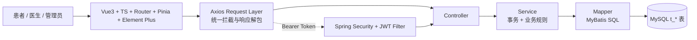

# 项目整体说明

> 项目名称：医院在线预约挂号系统  
> 文档版本：2026-04-27  
> 基准来源：前后端实际代码 + `backend/数据库初始化脚本/db.sql`

## 1. 项目概述

本项目是一个前后端分离的在线预约挂号系统，围绕“患者线上预约、医生接诊、管理员维护号源”构建完整闭环。系统支持患者、医生、管理员三类角色，目标是让挂号过程标准化、可追踪、可校验，并尽量降低并发场景下的号源错误风险。

核心业务闭环：

1. 患者注册/登录
2. 浏览科室与医生
3. 查询医生排班与号源
4. 提交预约
5. 查看/取消预约
6. 医生查看预约并完成就诊
7. 管理员维护排班与统计

## 2. 角色与功能范围

### 2.1 患者端

- 登录、注册、用户名可用性校验
- 科室/医生查询、医生详情查看
- 医生排班查询（近7天/未来）
- 就诊人管理（增删改查、默认就诊人）
- 在线预约、取消预约、预约记录查询

### 2.2 医生端

- 医生个人档案查询
- 全部预约、今日预约、按状态筛选
- 医生个人统计
- 完成就诊（将 `PENDING` 改为 `COMPLETED`）

### 2.3 管理端

- 管理员创建账号（ADMIN/DOCTOR）
- 排班管理（创建、更新、删除、增减余号）
- 公告管理（后端 CRUD）
- 预约统计查询

## 3. 技术选型及原因

### 3.1 后端技术栈

| 技术 | 版本 | 选型原因 |
| --- | --- | --- |
| Spring Boot | 3.2.0 | 快速构建 REST 服务，生态成熟 |
| Spring Security | 6.x（随 Boot） | 统一认证鉴权，支持路径与方法级权限控制 |
| JWT（jjwt） | 0.12.3 | 无状态登录，适配前后端分离 |
| MyBatis + MyBatis-Plus | 3.0.3 / 3.5.8 | SQL 可控，便于实现业务约束和原子更新 |
| MySQL | 8.x/9.x 驱动 | 事务、约束、索引能力稳定 |
| Jakarta Validation | Boot 内置 | DTO 参数校验，提升接口边界可靠性 |
| springdoc-openapi | 2.3.0 | 自动生成 Swagger/OpenAPI 文档 |

### 3.2 前端技术栈

| 技术 | 版本 | 选型原因 |
| --- | --- | --- |
| Vue 3 | 3.4.x | 组件化与组合式 API，维护成本低 |
| TypeScript | 5.4.5 | 提升接口联调时的类型安全 |
| Vue Router | 4.2.x | 多角色路由守卫与页面权限控制 |
| Pinia | 2.1.x | 统一管理 token 与用户角色状态 |
| Axios | 1.6.x | 拦截器统一处理鉴权与错误提示 |
| Element Plus | 2.5.x | 快速构建业务页面和管理台组件 |
| Vite | 5.x | 启动快、构建快，开发体验好 |
| ECharts | 6.0.0 | 统计看板可视化展示 |

### 3.3 工程与文档

- 统一响应模型：`BaseResponse<T>`（`code/message/data`）
- API 文档入口：`/swagger-ui/index.html`
- 数据库主基准：`backend/数据库初始化脚本/db.sql`

## 4. 项目架构说明

### 4.1 总体架构图



### 4.2 后端分层职责

- Controller：处理请求参数、鉴权上下文、返回 `BaseResponse`
- Service：承载核心业务规则、事务边界与权限内校验
- Mapper：编写关键 SQL（含库存原子扣减、统计查询）
- Database：通过唯一索引/外键保证最终一致性兜底

### 4.3 前端组织方式

- `router`：按角色控制访问路径（患者/医生/管理员）
- `stores/user.ts`：保存 token 与角色信息
- `api/request.ts`：统一注入 Authorization、统一处理错误码
- `views/**`：按场景拆分页面（患者流程、医生工作台、管理页）

## 5. 业务思考（重点）

### 5.1 在线挂号场景的特殊业务规则

1. 预约前置校验严格串行  
先验身份与归属，再验排班与号源，最后才落库，防止非法组合提交。

2. 同就诊人同科室同日防重复  
应用层先查重，数据库唯一键 `uk_patient_dept_date` 再兜底。

3. 取消窗口约束  
仅 `PENDING` 且创建后 30 分钟内可取消，避免随意占号后长期锁号源。

4. 号源状态联动  
余号扣减到 0 自动置 `FULL`；取消回补后必要时恢复 `AVAILABLE`。

5. 医生操作边界  
医生只能操作自己名下预约，且仅能将 `PENDING` 改为 `COMPLETED`。

### 5.2 数据一致性保证策略

1. 事务一致性  
创建预约与取消预约都在事务中执行，保证“预约记录 + 号源库存”同成同败。

2. 原子库存扣减  
通过条件更新避免负库存：

```sql
UPDATE t_schedule
SET remaining_amount = remaining_amount - 1
WHERE id = #{id} AND remaining_amount > 0
```

3. 约束兜底  
关键唯一索引与外键约束阻断脏数据写入。

4. 应用层 + 数据层双保险  
应用层做业务校验，数据库做最终一致性保护。

### 5.3 当前实现边界（真实现状）

1. `queue_number` 采用“当前有效预约数 + 1”，极高并发下可能出现并列号。
2. `uk_patient_dept_date` 不区分状态，取消后同日同科室默认不可重约。


## 6. 使用 AI 编程工具的体会（必须说明）

本项目在开发和文档阶段均持续使用 AI 编程工具，整体收益明显，但也形成了清晰边界。

### 6.1 收益

1. 提升实现速度：基础 CRUD、DTO、前端 API 封装可快速生成。
2. 降低联调成本：接口字段对齐、异常码归类、文档草案生成效率高。
3. 提升文档同步性：可基于代码反推文档，减少“文档落后代码”。

### 6.2 边界与经验

1. AI 擅长加速，不替代业务决策。  
挂号规则（取消窗口、重复预约判定、权限边界）必须由人工确认。

2. 关键链路必须代码级复核。  
尤其是事务、库存扣减、权限校验、索引约束，不能只看自然语言描述。

3. 最佳实践是“AI 提速 + 人工验收”。  
AI 负责草拟与补全，人负责业务正确性与风险兜底。

## 7. 项目结构（简版）

```text
hospital-registration-system/
├─ backend/
│  ├─ src/main/java/com/hospital/registration/
│  │  ├─ controller/
│  │  ├─ service/impl/
│  │  ├─ mapper/
│  │  ├─ model/
│  │  └─ config/
│  └─ 数据库初始化脚本/
│     ├─ db.sql
│     └─ data.sql
├─ frontend/
│  └─ src/
│     ├─ api/
│     ├─ router/
│     ├─ stores/
│     └─ views/
└─ docs/
```

## 8. 总结

该项目已形成“患者预约-医生处理-管理维护”的完整业务闭环，并通过事务、原子 SQL、索引约束和权限控制构建了可落地的一致性保障体系。后续若继续优化，建议优先加强 `queue_number` 并发生成策略与联调自动化测试覆盖。

