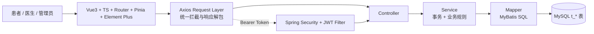

# 项目整体说明

> 项目名称：医院在线预约挂号系统  
> 文档版本：2026-04-27  
> 基准来源：前后端实际代码 + `backend/数据库初始化脚本/db.sql`

## 1. 项目概述

本项目是一个前后端分离的在线预约挂号系统，围绕“患者线上预约、医生接诊、管理员维护号源”构建完整闭环。系统支持患者、医生、管理员三类角色，目标是让挂号过程标准化、可追踪、可校验，并尽量降低并发场景下的号源错误风险。

核心业务闭环：

1. 患者注册/登录
2. 浏览科室与医生
3. 查询医生排班与号源
4. 提交预约
5. 查看/取消预约
6. 医生查看预约并完成就诊
7. 管理员维护排班与统计

## 2. 角色与功能范围

### 2.1 患者端

- 登录、注册、用户名可用性校验
- 科室/医生查询、医生详情查看
- 医生排班查询（近7天/未来）
- 就诊人管理（增删改查、默认就诊人）
- 在线预约、取消预约、预约记录查询

### 2.2 医生端

- 医生个人档案查询
- 全部预约、今日预约、按状态筛选
- 医生个人统计
- 完成就诊（将 `PENDING` 改为 `COMPLETED`）

### 2.3 管理端

- 管理员创建账号（ADMIN/DOCTOR）
- 排班管理（创建、更新、删除、增减余号）
- 公告管理（后端 CRUD）
- 预约统计查询

## 3. 技术选型及原因

### 3.1 后端技术栈

| 技术 | 版本 | 选型原因 |
| --- | --- | --- |
| Spring Boot | 3.2.0 | 快速构建 REST 服务，生态成熟 |
| Spring Security | 6.x（随 Boot） | 统一认证鉴权，支持路径与方法级权限控制 |
| JWT（jjwt） | 0.12.3 | 无状态登录，适配前后端分离 |
| MyBatis + MyBatis-Plus | 3.0.3 / 3.5.8 | SQL 可控，便于实现业务约束和原子更新 |
| MySQL | 8.x/9.x 驱动 | 事务、约束、索引能力稳定 |
| Jakarta Validation | Boot 内置 | DTO 参数校验，提升接口边界可靠性 |
| springdoc-openapi | 2.3.0 | 自动生成 Swagger/OpenAPI 文档 |

### 3.2 前端技术栈

| 技术 | 版本 | 选型原因 |
| --- | --- | --- |
| Vue 3 | 3.4.x | 组件化与组合式 API，维护成本低 |
| TypeScript | 5.4.5 | 提升接口联调时的类型安全 |
| Vue Router | 4.2.x | 多角色路由守卫与页面权限控制 |
| Pinia | 2.1.x | 统一管理 token 与用户角色状态 |
| Axios | 1.6.x | 拦截器统一处理鉴权与错误提示 |
| Element Plus | 2.5.x | 快速构建业务页面和管理台组件 |
| Vite | 5.x | 启动快、构建快，开发体验好 |
| ECharts | 6.0.0 | 统计看板可视化展示 |

### 3.3 工程与文档

- 统一响应模型：`BaseResponse<T>`（`code/message/data`）
- API 文档入口：`/swagger-ui/index.html`
- 数据库主基准：`backend/数据库初始化脚本/db.sql`

## 4. 项目架构说明

### 4.1 总体架构图



### 4.2 后端分层职责

- Controller：处理请求参数、鉴权上下文、返回 `BaseResponse`
- Service：承载核心业务规则、事务边界与权限内校验
- Mapper：编写关键 SQL（含库存原子扣减、统计查询）
- Database：通过唯一索引/外键保证最终一致性兜底

### 4.3 前端组织方式

- `router`：按角色控制访问路径（患者/医生/管理员）
- `stores/user.ts`：保存 token 与角色信息
- `api/request.ts`：统一注入 Authorization、统一处理错误码
- `views/**`：按场景拆分页面（患者流程、医生工作台、管理页）

------------------------------------------## 5. 对开发过程中具体业务的思考--------------------------------------------------

### 5.1 针对在线预约挂号场景中的特殊业务规则

1. 预约前置校验采用“强顺序”链路  
先校验登录身份与就诊人归属，再校验排班合法性（医生匹配、日期合法、非停诊、余号充足），最后才执行落库。  
这样可以尽早拦截非法请求，减少无效数据库的写操作。

2. 同就诊人在同科室的同一日内防重复预约请求（仅针对有效预约）  
当前规则是：同一就诊人、同一科室、同一天，若存在 `status != CANCELLED` 的预约，则禁止再次预约。  
说明：为支持“取消后可重约”，数据库层不再使用 `uk_patient_dept_date` 唯一键，改由应用层规则进行判断控制。

3. 取消窗口约束  
当预约记录处于 `PENDING` 状态且创建后 的30 分钟内才允许取消，避免恶意占号和长期锁定号源。

4. 号源与状态联动  
预约成功后扣减余号，余号为 0 自动置为 `FULL`；  
取消预约后回补余号，若原状态为 `FULL` 且余号恢复，则切回 `AVAILABLE`。

5. 医生端操作边界  
医生只能操作自己名下预约，且仅允许将 `PENDING` 更新为 `COMPLETED`，避免越权和非法状态迁移。

6. 排班管理约束（管理员操作）  
同一医生同一日期的同一时段内禁止重复排班；  
修改总号源时不能小于已使用号源；  
已有预约占用的排班不允许删除。

---
### 5.2 数据一致性保证策略

1. 事务一致性（要么都成功要么都失败）  
创建预约、取消预约均在事务中执行，确保“预约记录 + 号源库存 + 状态变化”原子提交。

2. 原子库存扣减（防超卖问题）  
通过条件更新在数据库中保证扣减安全：

```sql
UPDATE t_schedule
SET remaining_amount = remaining_amount - 1
WHERE id = #{id} AND remaining_amount > 0


### 5.3 当前实现边界（真实现状）

1. `queue_number` 采用“当前有效预约数 + 1”，极高并发下可能出现并列号。


-------------------------------------## 6. 开发过程中使用 AI 编程工具的体会--------------------------------

在实际开发过程中，AI编程工具不仅极大的缩短了开发周期，还能发现项目中存在的隐性Bug并及时修改优化；
本此项目从市场调研、需求分析、服务划分、技术选型、前后端联调排障以及最终的说明文档产出全流程中都使用了 AI 工具。
总体的结论是：  
1.使用AI编程工具极大的减少了我写代码的工作量，更多的时候是在读代码，降低了如何用代码来实现业务的难度，更加考验开发者对业务的熟悉程度和项目架构的组成；
2.使用AI工具协助开发，能及时发现存在的Bug，同时也减少Bug对开发进度的拖延，我只需要定位到错误日志的关键信息，其余的交给AI，一段日志信息就能让Bug无处遁形。
3.使用AI过程中，需要注重在对话中积极引导AI干活，要懂得将一个大的问题拆分成一个个小问题来让AI解决，这不仅能极大程度提高AI的办事效率，还能精化AI的具体工作流程，避免大幅度改动导致连锁问题。
4.使用过程中，需要注重上下文的切换，AI对话的背景信息是有限的，需要定期维护上下文，对上下文进行必要的总结概况，以便开启新对话时不会降智太严重，减少训练AI的时间。比如我最常用到的话，背景信息即将耗尽，请总结当前对话中对本项目的关键决策、已完成部分、代办事项、重要文件修改记录和整体架构思路，输出成一个结构化的Markdown文件，便于我下次开启新会话时直接进行开发。

### 6.1 核心收益

1. 研发提速明显  
基础 CRUD、DTO、接口封装、页面骨架等重复性工作可快速完成，把时间释放到关键业务规则设计与验证上。

2. 联调效率提升  
在接口字段命名、响应结构统一、错误码归类、前后端契约对齐方面，AI 能快速给出可执行方案，减少沟通与反复修改成本。

3. 文档与代码同步能力增强  
可基于当前代码反向整理 API、数据库与业务流程，显著降低“文档滞后代码”的风险。

### 6.2 边界与实践经验

1. AI 负责加速，不替代业务裁决  
挂号场景中的核心规则（取消窗口、重复预约判定、角色权限边界）本质是业务决策，但最终必须由人工进行确认。

2. 关键链路必须代码级复核  
事务边界、号源扣减、状态流转、权限校验、索引约束等高风险环节，必须以实际代码与 SQL 为准，不能仅依赖自然语言描述。

3. 采用“AI 草拟 + 人工验收”协作模式  
AI 负责草拟、补全与重构建议；人工负责业务正确性、异常兜底与上线风险评估。  


### 6.3 本项目沉淀的可复用方法

1. 先由 AI 产出初稿，再以代码反向校准  
以 Controller/Service/Mapper/DDL 为基准逐项核对，确保文档与实现一致。

2. 对高风险点建立“必检清单”  
固定检查：预约创建事务、库存原子扣减、取消回补、权限越权、防重复规则。

3. 将 AI 输出纳入版本化流程  
所有 AI 产出都落到仓库文件并进行评审留痕，避免“对话里正确、仓库里缺失”。


## 7. 项目结构（简版）

```text
hospital-registration-system/
├─ backend/
│  ├─ src/main/java/com/hospital/registration/
│  │  ├─ controller/
│  │  ├─ service/impl/
│  │  ├─ mapper/
│  │  ├─ model/
│  │  └─ config/
│  └─ 数据库初始化脚本/
│     ├─ db.sql
│     └─ data.sql
├─ frontend/
│  └─ src/
│     ├─ api/
│     ├─ router/
│     ├─ stores/
│     └─ views/
└─ docs/
```

## 8. 总结

该项目已形成“患者预约-医生处理-管理维护”的完整业务闭环，并通过事务、原子 SQL、索引约束和权限控制构建了可落地的一致性保障体系。后续若继续优化，建议优先加强 `queue_number` 并发生成策略与联调自动化测试覆盖。

